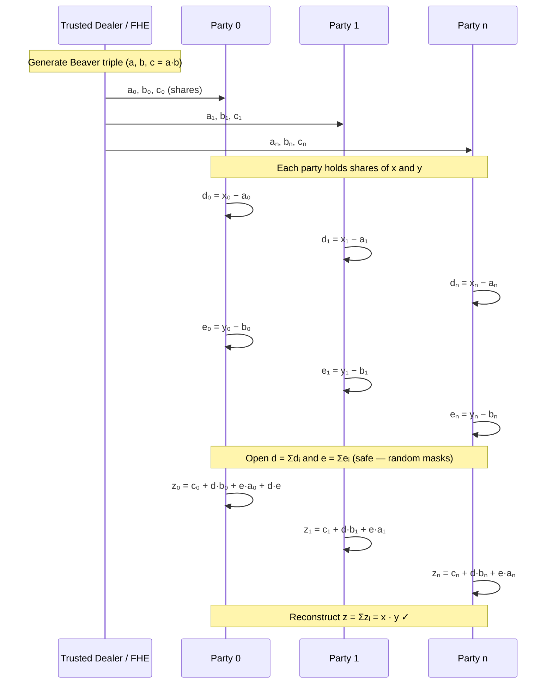
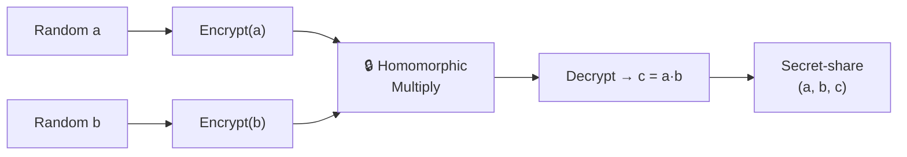

# SMPC + FHE Demo

> **Secure Multi-Party Computation** meets **Fully Homomorphic Encryption** — a hands-on Python demo that lets multiple parties jointly compute a result without anyone revealing their private inputs.

---

## What Does This Project Do?

This project implements advanced cryptographic protocols that allow multiple parties to compute additions and multiplications on private data without any single party ever seeing the raw inputs. Normally, to compute a result (like an average or a sum), you must have access to the raw data. This project removes that necessity.
* **Example Use-Case:** Calculating the average credit card risk across $N$ different banks. Using this system, the banks find the collective average without any single bank ever knowing the specific risk scores of the other $N-1$ parties.

| Technique | One-Liner | Project Role |
| :--- | :--- | :--- |
| **SMPC** (Secure Multi-Party Computation) | Multiple parties compute a function together—each party learns the *final result*, never the inputs. | Orchestrates secure multiplication and addition across 5 independent nodes. |
| **FHE** (Fully Homomorphic Encryption) | Perform math on *encrypted* data—get the correct answer without ever decrypting the inputs. | Generates the secret pre-computation material (**Beaver Triples**) required for the protocol. |

This demo combines the strengths of both fields to ensure both security and performance:

1.  **The FHE Engine:** Used as the "offline" phase to generate **Beaver Triples** (pre-computed encrypted material).
2.  **The SMPC Protocol:** Uses those triples in the "online" phase to perform high-speed, secure multiplications across **5 independent parties**.

By separating these concerns, the system maintains the rigorous security of FHE while leveraging the execution speed of SMPC for real-time calculations.

---


## Core Concepts

### SMPC in Simple English

1. **Secret Sharing** — Each private number is split into random "puzzle pieces" (shares). One piece alone is meaningless.
2. **Local Computation** — Each party does arithmetic *only* on its own pieces.
3. **Reconstruction** — Only when *all* parties pool their result-pieces can the final answer be recovered.

Addition is trivial (each party adds its shares locally). Multiplication is harder — it requires a clever trick called a **Beaver triple**: a pre-computed `(a, b, c)` with `c = a × b` that masks the real inputs during the protocol.

### FHE in Simple English

Fully Homomorphic Encryption lets you **compute on ciphertexts**. You encrypt two numbers, multiply their ciphertexts, decrypt the result — and you get the correct product — *without the multiplier ever seeing the plaintext*.

In this project, the BFV (Brakerski/Fan–Vercauteren) scheme produces exact integer arithmetic in encrypted space. This is used to generate Beaver triples: the product `c = a × b` is computed homomorphically so that no single party observes both factors in the clear.

---

## Protocol Flow

### Beaver Multiplication Protocol (Scalar)



### FHE Beaver Triple Generation
    Addition is trivial (each party adds its shares locally). There are two common addition patterns used in this demo:

    - Scalar addition: each party holds `x_i` and `y_i` and computes `s_i = x_i + y_i (mod p)` locally; reconstructing the `s_i` shares yields `x + y` without revealing individual inputs.
    - Matrix (element-wise) addition: the same idea applied element-wise — each matrix entry is secret-shared and parties add corresponding shares locally to produce shares of the sum matrix.

    Multiplication is harder — it requires a clever trick called a **Beaver triple**: a pre-computed `(a, b, c)` with `c = a × b` that masks the real inputs during the protocol.


### System Architecture (Networked Demo)

```mermaid
flowchart TB
    CLI["CLI Entry Point\norchestrator.py"] --> SPAWN["Spawn N party nodes"]
    SPAWN --> N0["Node 0\n:12000"]
    SPAWN --> N1["Node 1\n:12001"]
    SPAWN --> N2["Node 2\n:12002"]
    SPAWN --> N3["Node 3\n:12003"]
    SPAWN --> N4["Node 4\n:12004"]

    CLI --> TRIPLE["Generate Beaver\nTriple (plain / FHE)"]
    │   ├── run_scalar.py                # In-memory scalar add & multiply demo (examples/run_scalar.py)
    DIST --> N0
    │   └── run_matrix.py                # In-memory matrix add & multiply demo (examples/run_matrix.py)
    DIST --> N1
    DIST --> N2
    DIST --> N3
    DIST --> N4

    N0 --> RESULT["Collect z-shares\n& Reconstruct"]
    N1 --> RESULT
    N2 --> RESULT
    N3 --> RESULT
    N4 --> RESULT
    RESULT --> OUTPUT["Print x × y = z"]
```

---

## Project Structure

```
smpc_demo/
├── config.py                        # Global constants (FIELD_PRIME, NUM_PARTIES, BFV params)
│
├── crypto_core/                     # ─── Cryptographic building blocks ───
│   ├── field.py                     # Modular arithmetic over Z_p  +  type aliases
│   ├── secret_sharing.py            # Additive secret sharing (share / reconstruct)
│   ├── beaver.py                    # Beaver triple generation (trusted dealer)
│   └── fhe.py                      # BFV FHE engine  +  FHE-based triple generation
│
├── protocols/                       # ─── SMPC protocol logic ───
│   ├── secure_ops.py                # In-memory secure add & multiply (Beaver protocol)
│   └── matrix_arithmetic.py           # In-memory secure matrix multiplication
│
├── network/                         # ─── TCP transport & orchestration ───
│   ├── transport.py                 # send_command / recv_all helpers
│   ├── node.py                      # Individual party TCP server
│   └── orchestrator.py              # Coordinator: spawns nodes, drives protocol, CLI
│
├── examples/                        # ─── Runnable demos (showing add & multiply) ───
│   ├── run_scalar.py                # In-memory scalar add & multiply demo (examples/run_scalar.py)
│   └── run_matrix.py                # In-memory matrix add & multiply demo (examples/run_matrix.py)
|
├── requirements.txt
├── run_command.txt                   # Quick-reference CLI commands
└── README.md                        # ← You are here
```

**Design principle:** each file serves *one* purpose. Type aliases (`FieldElement`, `SecretShare`, `ShareVector`, `BeaverTriple`) in `crypto_core/field.py` make the data flow self-documenting.

---

## Quick Start

### 1. Install dependencies

```bash
cd smpc_demo
pip install -r requirements.txt
```

### 2. Run the in-memory demo (no networking)

```bash
# Scalar secure multiplication (25 × 9 = 225)
python -m examples.run_scalar

# Matrix secure multiplication ([[1,2],[3,4]] × [[5,6],[7,8]])
python -m examples.run_matrix
```

### 3. Run the networked demo (TCP party nodes)

```bash
# Scalar — spawns 5 nodes, computes 25 × 9 securely
python -m network.orchestrator --spawn --scalar --x 25 --y 9

# Same, but Beaver triples generated via FHE (BFV)
python -m network.orchestrator --spawn --scalar --use-fhe --x 25 --y 9

# Matrix multiplication (4×4 identity × test matrix)
python -m network.orchestrator --spawn --matrix --use-fhe
```

Detailed share-level traces are written to `logs/smpc_orchestrator.log` for scalar operations.


---

## How a Secure Scalar Multiply Works (Step by Step)

Suppose two parties want to compute **25 × 9 = 225** without either one knowing the other's input.

| Step | What happens | Who sees what |
|------|-------------|---------------|
| 1 | Each input is **split into 5 random shares** that sum to the input mod *p*. | No single party sees 25 or 9. |
| 2 | A **Beaver triple** `(a, b, c)` is generated (optionally via FHE) and its shares distributed. | No party sees `a`, `b`, or `c` in the clear. |
| 3 | Each party computes **masked differences** `dᵢ = xᵢ − aᵢ` and `eᵢ = yᵢ − bᵢ`. | Only masked values are shared. |
| 4 | All parties **open** `d` and `e`. These are uniformly random — revealing them leaks *nothing*. | `d` and `e` are public but useless alone. |
| 5 | Each party computes `zᵢ = cᵢ + d·bᵢ + e·aᵢ (+d·e for party 0)`. | Each party holds *one* share of the result. |
| 6 | **Reconstruct:** `z = Σzᵢ mod p = 225` ✓ | Only the final result is revealed. |

---

## Known Limitations

- **Matrix size:** Reliable up to **3×3** matrices. Larger dimensions may hit timing or modular constraints.
- **BFV plaintext modulus:** The default `t = 65 537` means the random Beaver factors are capped at 200. Larger values require increasing `BFV_PLAIN_MODULUS` in `config.py`.
- **Demo security model:** The networked demo runs all nodes on `localhost` — it demonstrates the *protocol*, not production-grade network security.
